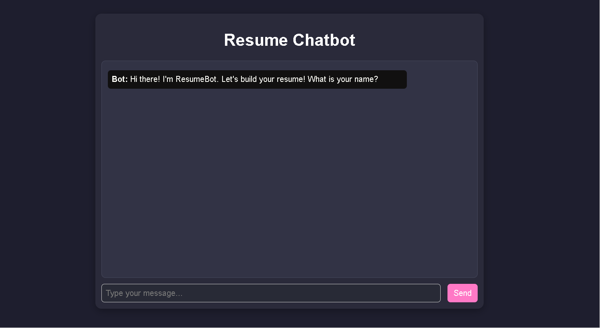
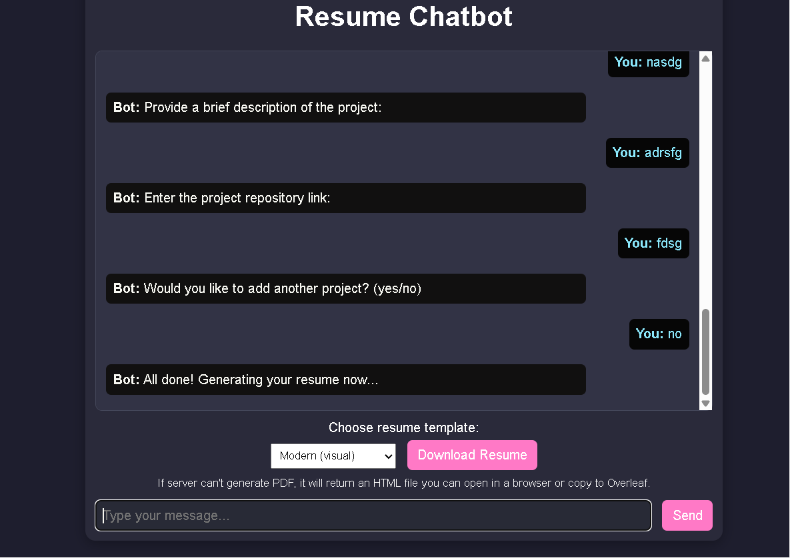

# 📄 Chatbot Resume Builder  

An **AI-powered Resume Builder** built with **Flask**, **Groq API**, and **PDF generation tools**.  
This chatbot interacts with users step by step to collect details (name, education, skills, certifications, projects) and generates a **professional resume PDF** in different formats (ATS, Classic, Modern).  

---

## 🚀 Features  
- 🤖 **Chatbot Flow** – step-by-step questions to gather resume data.  
- ⚡ **Groq API Integration** – auto-suggest related sub-skills and refine resume content.  
- 📑 **Multiple Templates** – choose between **ATS-friendly**, **Classic**, or **Modern** resume designs.  
- 📂 **Direct PDF Download** – generates and downloads the resume instantly.  
- 🖥️ **Web Interface** – clean UI with chat history, chip-style sub-skill selection, and resume download button.  

---

## 🛠️ Tech Stack  
- **Backend:** Flask, Python  
- **Frontend:** HTML, CSS, JavaScript  
- **AI Engine:** Groq API (LLM-based skill suggestions & resume polishing)  
- **PDF Tools:** FPDF / pdfkit  

---

## 📷 Interface Demo  

### Chat Interface  
  


  


### Resume Download  


---

## ⚙️ Installation  

```bash
# Clone the repository
git clone https://github.com/yourusername/chatbot-resume-builder.git
cd chatbot-resume-builder

# Create virtual environment
python -m venv venv
source venv/bin/activate   # On Windows: venv\Scripts\activate

# Install dependencies
pip install -r requirements.txt
▶️ Run the App
bash
Copy code
# Start Flask server
python app.py
Then open: http://127.0.0.1:5000/ in your browser.

📂 Project Structure
graphql
Copy code
chatbot-resume-builder/
│── app.py              # Main Flask app  
│── templates.py        # Resume templates (ATS, Classic, Modern)  
│── templates/          # HTML templates (chatbot UI)  
│   └── chatbot.html  
│── static/             # Static files (CSS, JS, generated resumes)  
│   ├── styles.css  
│   └── resume.pdf  
│── requirements.txt    # Dependencies  
│── docs/               # Screenshots / GIFs for README  
│── README.md  

---

##
📌 Future Improvements
Add more templates (creative, minimal, infographic).

Deploy on Render / Railway / Heroku.

Allow users to edit generated resumes in-browser before download.

Add authentication for saving multiple resumes per user.

🏆 Credits
Built with ❤️ using Flask + Groq API.